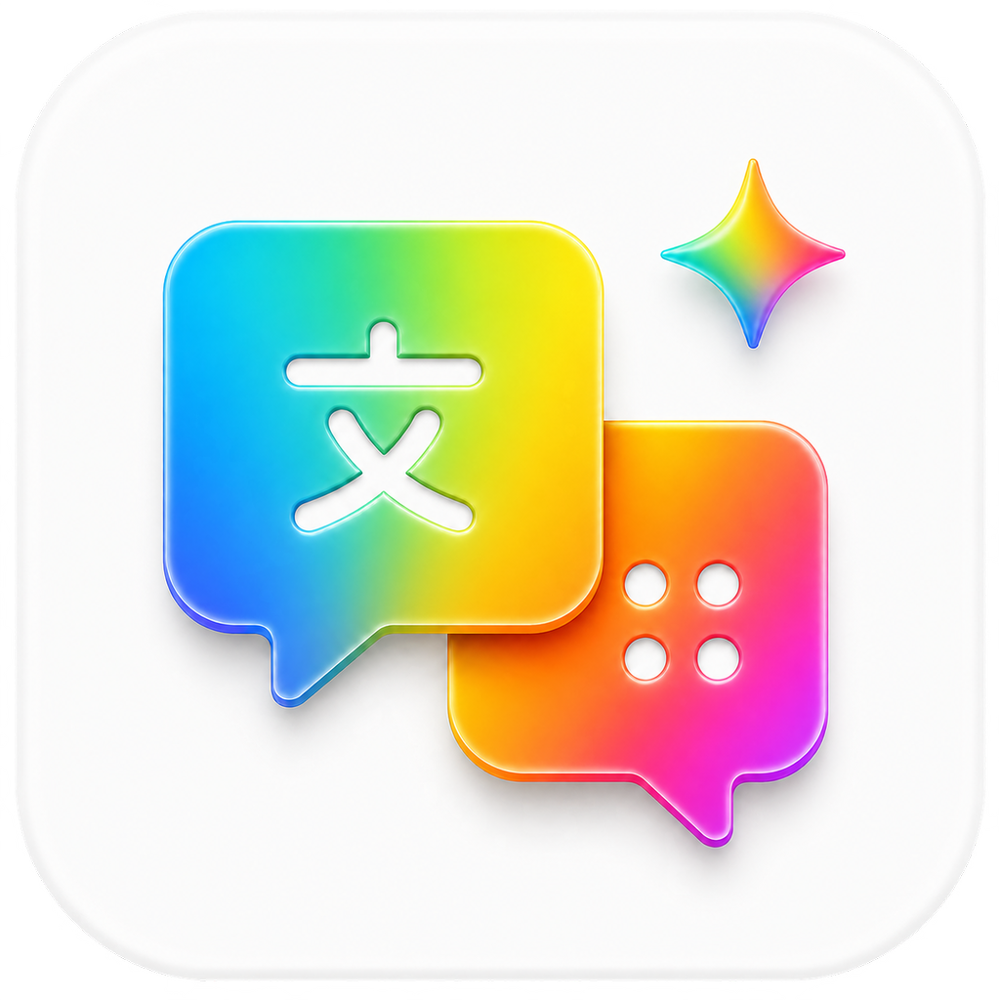

<div align="center">
  
  <h1>Antigravity 中文助手</h1>
</div>

Antigravity 中文助手是一个面向 Windows 和 macOS 的非官方运行时汉化伴侣。它通过 Antigravity 的本地调试接口加载翻译，不修改 Antigravity 官方安装文件。翻译器只处理可识别的系统界面元素，默认跳过输入框、代码块、可编辑区域以及对话/项目内容。

## 普通用户使用

1. 从 [Releases](https://github.com/CX-ARTLab/antigravity-zh-assistant/releases/latest) 下载发布页中的 `AntigravityZhAssistant-windows.zip`（PR 合并并发布新版本后提供）。
2. 将 ZIP 解压到任意文件夹。无需安装 SDK，也不需要把 EXE 放进 Antigravity 安装目录。
3. 先启动 Antigravity，再运行解压后的 `AntigravityZhAssistant.exe`。
4. 点击紫色状态按钮应用或恢复汉化；“自动更新”会定期检查并重新应用翻译，“开机启动”可让助手随 Windows 启动。

这是一个便携版程序：移动整个解压文件夹即可移动助手，卸载时直接删除该文件夹即可。


## 当前功能

- 运行时翻译 Antigravity 系统界面，不改原程序文件
- 自动监测 Antigravity 进程、版本变化和界面变化，并重新应用汉化
- 独立更新翻译包，无需重新下载助手
- 显示当前 Antigravity 版本和尚未纳入词典的“待适配”词条数量
- 支持“自动更新”和“开机启动”选项
- 扫描到的新词条会写入 `%LOCALAPPDATA%\Antigravity 中文助手\待适配词条.json`，便于后续补充翻译

## 兼容性与排错

- Windows 10/11，建议使用 64 位系统
- 需要本机已安装 Antigravity，并允许其本地调试接口正常启动
- 如果状态按钮提示未发现目标窗口，请先启动 Antigravity，再重新点击按钮
- 如果更新服务暂时不可用，助手会继续使用本地已有翻译包
- 若要反馈未翻译文字，请附上 `%LOCALAPPDATA%\Antigravity 中文助手\待适配词条.json`（其中可能包含界面文本）

## 翻译包

翻译词典位于 [`translation/translation-pack.json`](translation/translation-pack.json)，版本信息和下载地址位于 [`translation/manifest.json`](translation/manifest.json)。Windows 发布版会内置构建时的完整词典，离线也可使用；启用“自动更新”后还会检查并加载版本更新的远程词典。词典变化会触发重新注入，不需要重启 Antigravity。

## 本地构建

在 Windows PowerShell 中运行：

```powershell
.\build.ps1
```

生成的便携版程序位于 `dist/AntigravityZhAssistant.exe`。项目使用 Windows 自带的 .NET Framework C# 编译器，不需要额外安装 .NET SDK。GitHub Actions 会在发布流程中把程序、README 和许可证打包为 `AntigravityZhAssistant-windows.zip`。

## macOS 版本

仓库同时提供原生 SwiftUI macOS 目标，仅支持 macOS 12 及以上的 Apple Silicon（M1、M2、M3、M4 及后续芯片）设备。macOS 版复用同一翻译词典和 Chromium 调试注入逻辑，并使用 LaunchAgent 实现“开机启动”。

在 Mac 上构建：

```bash
bash macOS/build-macos.sh
```

构建脚本会生成 `dist/AntigravityZhAssistant-macOS-apple-silicon.zip`。GitHub Actions 仅构建 Apple Silicon 版本；首次发布前仍建议在实际 Mac 上验证 Antigravity 的调试接口和系统权限。

当前 macOS 构建未附带 Apple Developer 签名和公证；首次打开时如果 macOS 提示无法验证开发者，请在 Finder 中右键应用选择“打开”，或在“系统设置 → 隐私与安全性”中允许运行。

## 隐私与免责声明

助手只处理 Antigravity 的系统界面文本；输入框、代码块、可编辑区域、文件名和用户产物标题会被排除。待适配记录仅保存在本机，除非用户主动提交。

本项目不是 Google 或 Antigravity 官方产品，与其不存在隶属或授权关系。助手图标采用本项目原创的“中”字彩虹渐变设计，不使用官方 Antigravity 图标、Google 标志或品牌字样。“Google”和“Antigravity”及相关品牌资源归其各自权利人所有。MIT 许可证仅适用于本仓库中的源代码，不授予任何品牌或商标使用权。

